# WAYLO

Team AlgoKnights, IntelliCon 2026

Need something from abroad? WAYLO finds someone who is already flying to your city. They buy it new, carry it, declare it at customs and hand it to you. You pay up front, the money waits in escrow, and the traveller only gets paid when you give them a six digit code at the handover.

We are launching with India to Sri Lanka, but any route works.

**Landing page:** https://shageeshant.github.io/intellicon2026-AlgoKnights/

**Live app:** https://odcaum2ste.execute-api.ap-south-1.amazonaws.com

The live app runs in demo mode right now. The sign in code is shown on screen and payments go through the escrow ledger without charging a card, so you can try the whole flow yourself.

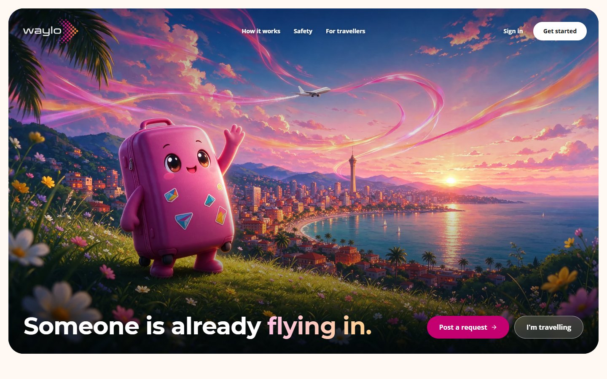

## About the source code

We were asked to share the full codebase so the panel can judge code quality. I understand why, but I can't do that, and I'd rather be upfront about the reason.

WAYLO isn't something we built for a weekend and will forget about. It's our startup. The app is built, it's running on AWS, and we're close to launching it for real. The code is not open source, and putting all of it in a public repo means anyone could walk off with the product we've spent weeks on.

So this repo has what we can share:

1. The landing page as real code, checked and deployed by a proper pipeline
2. Screenshots of the full product, including identity verification, escrow, the admin desk and our AWS setup
3. A write up of how the whole system is built, in [docs/architecture.md](docs/architecture.md)

On code quality, please don't worry. The private codebase is written in strict TypeScript, linted and type checked on every push, and the full order and escrow flow is covered by automated tests that have to pass before anything is deployed. Every push to main is tested and deployed to AWS automatically.

If the panel wants to look at the code itself, we're happy to share our screen and walk you through any part of it. We just can't publish it.

## How it works

1. You post what you need: the exact items, the most you'll pay, a reward and a deadline. Or you browse travellers landing in your city in the next 3 days, week, two weeks, month or three months and send your request to one of them.
2. Travellers whose trip fits the route, the date and their spare luggage make offers.
3. You accept one and pay once into escrow: the item budget, the reward, a duty allowance and our 8% fee.
4. The traveller buys each item new, uploads the receipt and a photo, and declares everything at customs.
5. You meet in a public place, check the items and read out your code. The traveller is paid, and anything unspent comes back to you.

## Screenshots

### Asking for something

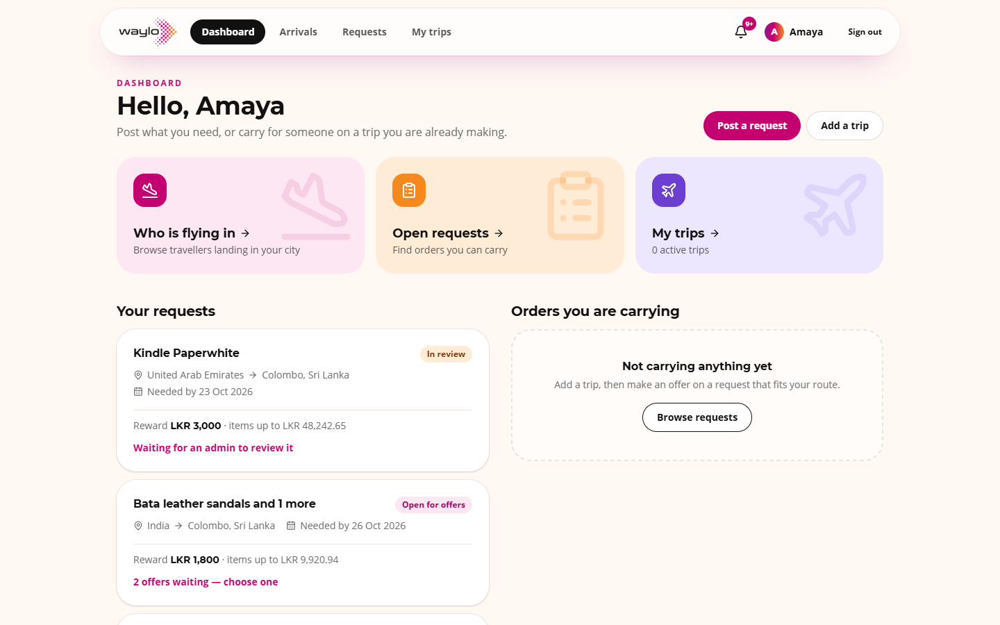

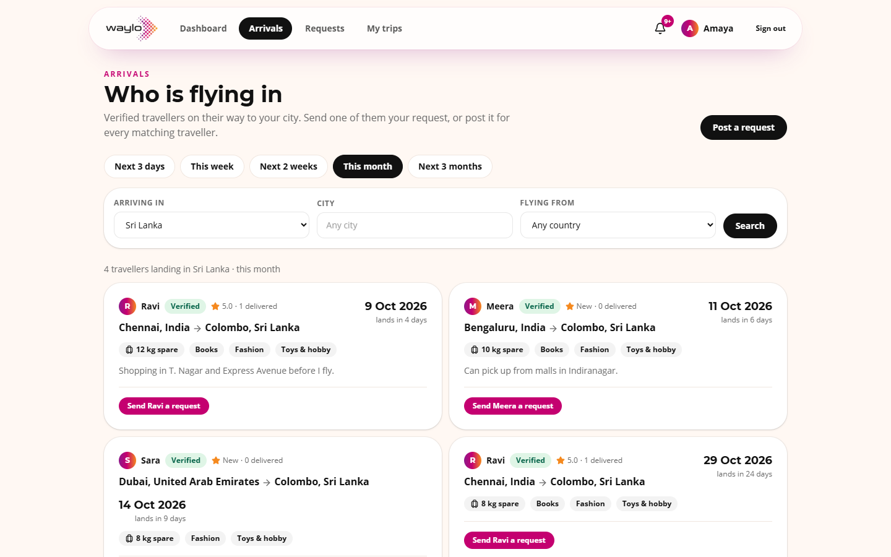

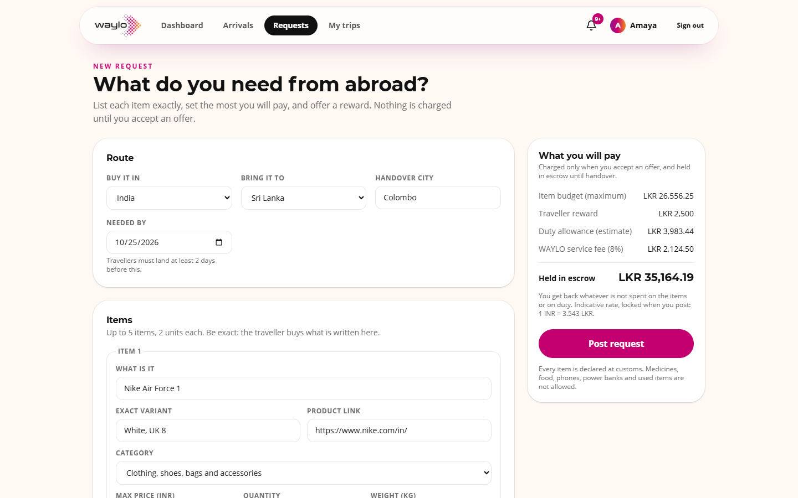

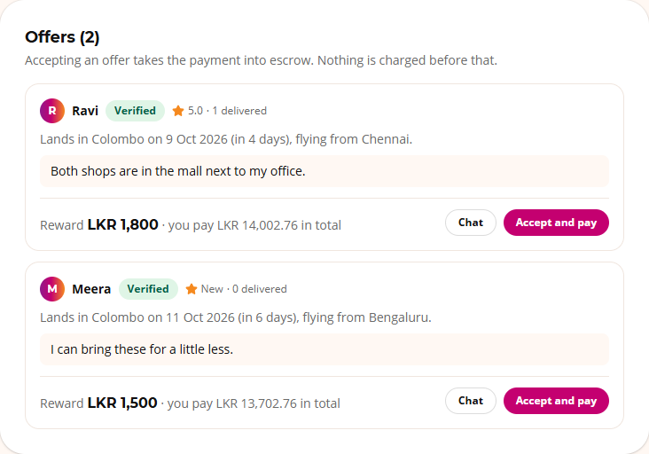

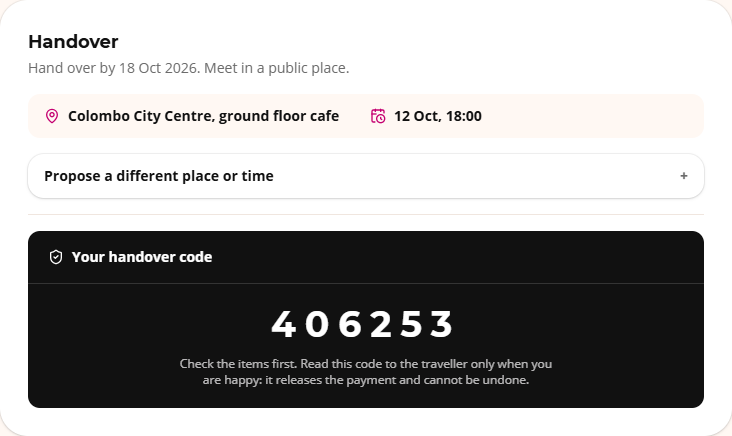

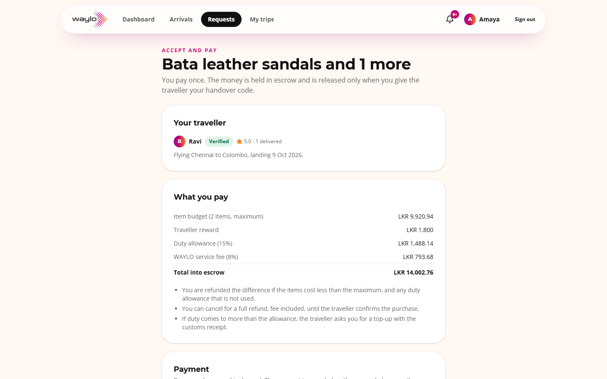

### Carrying it

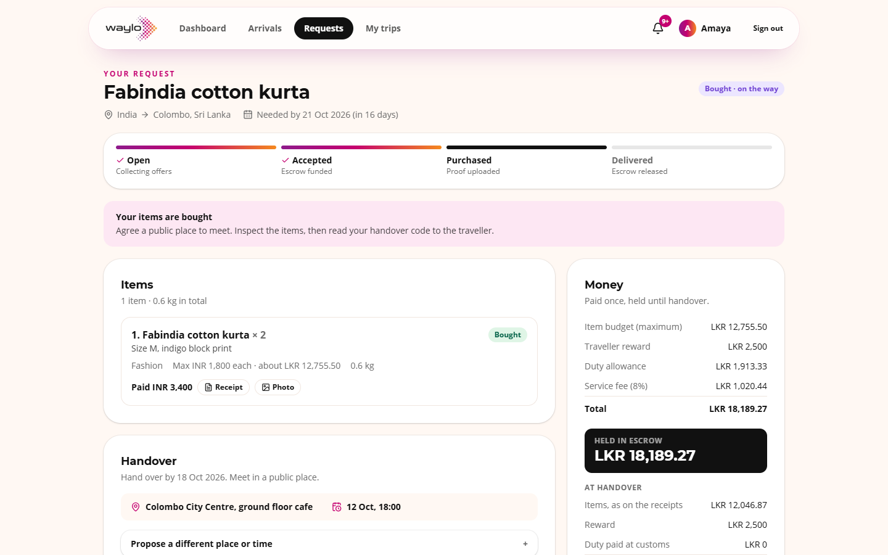

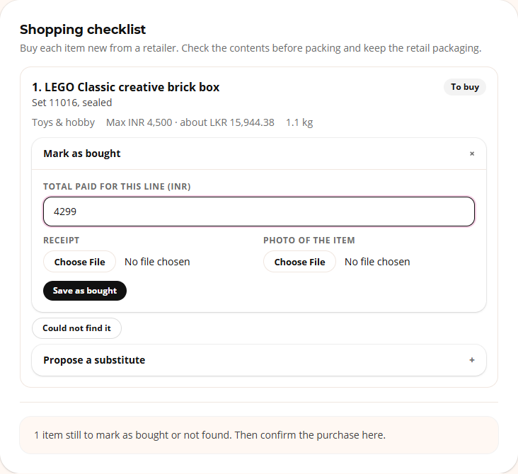

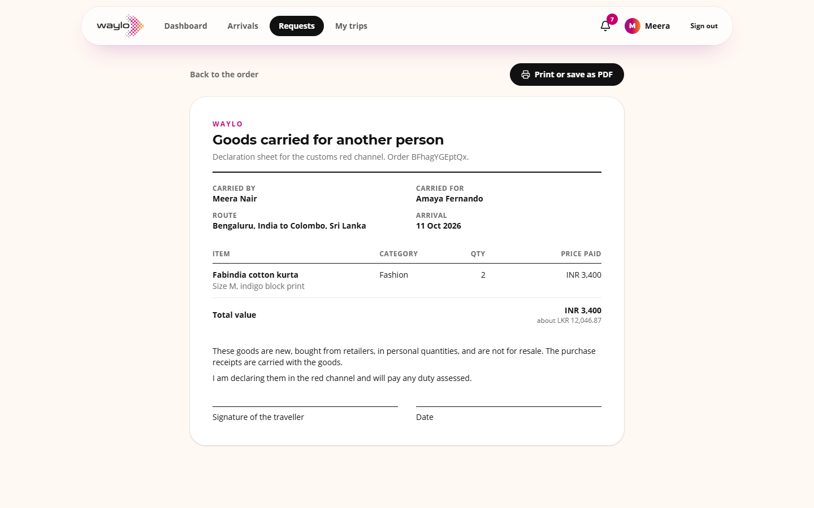

### Trust and safety

Phone numbers, emails and links are hidden in chat, so deals stay on the platform where escrow protects them.

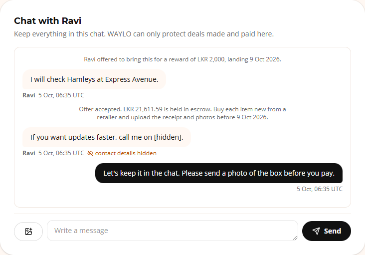

Everyone who pays or carries is verified first. They upload an ID and a selfie and an admin checks them. The ID and selfie below are drawn samples, not real people.

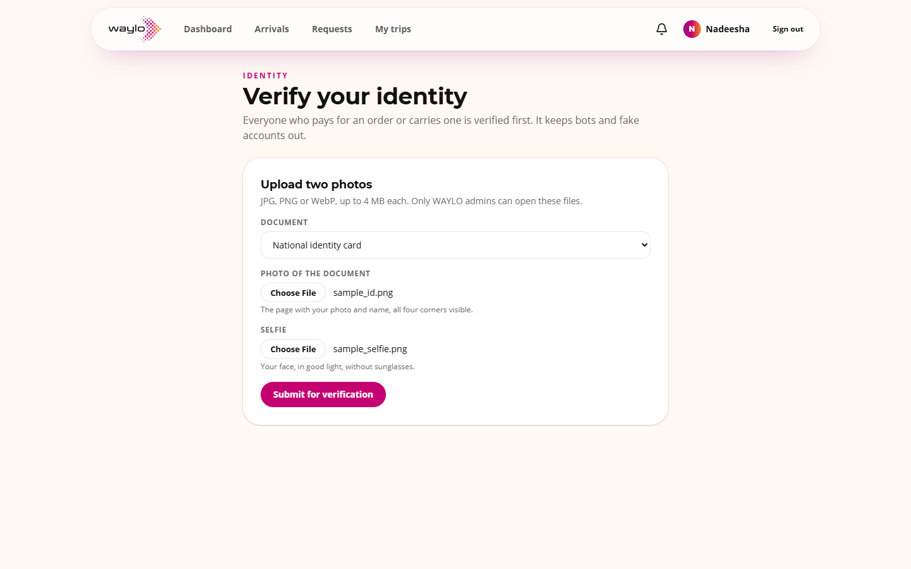

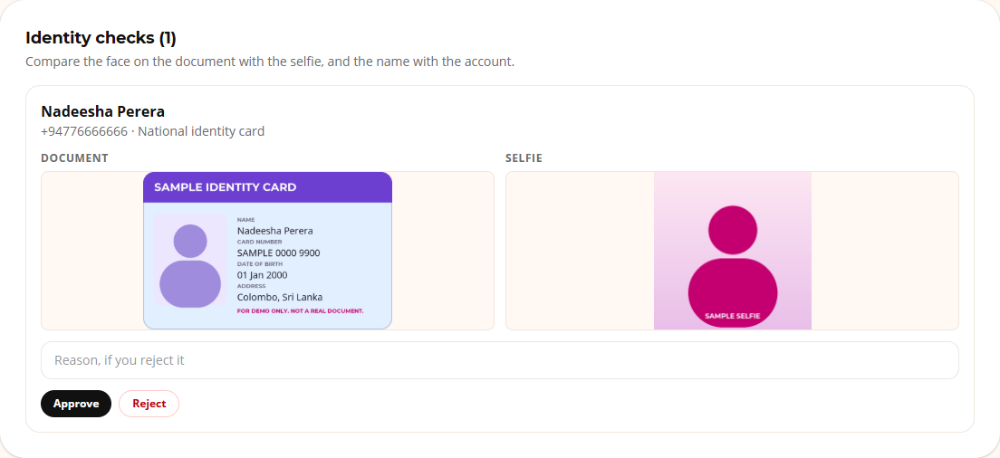

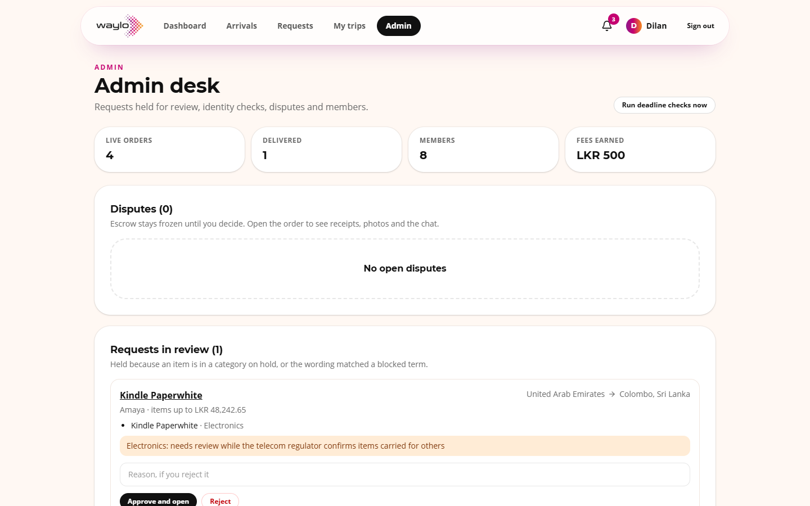

### On a phone

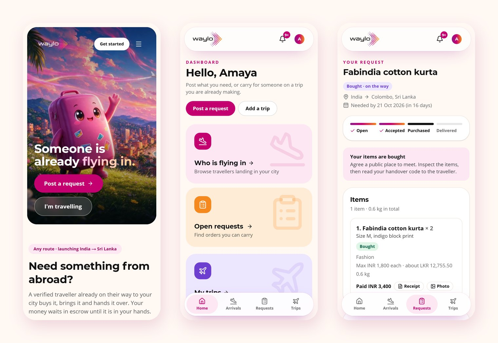

## This repo

The landing page is built with Next.js 16, TypeScript and Tailwind CSS 4, and exported as a static site to GitHub Pages.

Every push and pull request goes through the CI pipeline in [.github/workflows](.github/workflows): lint and type check, a production build, and Lighthouse on the built site. The build fails if accessibility, best practices or SEO drop below 95 or if the layout shifts. CodeQL scans the code and the workflows, and Dependabot keeps packages up to date.

Work happens on feature branches that merge into `dev` through pull requests. `dev` merges into `main` for a release, and only `main` deploys, after every check has passed. The files that go live are the exact build Lighthouse tested.

To run it locally:

```
npm ci
npm run dev
```

## License

All rights reserved. See [LICENSE](LICENSE).
